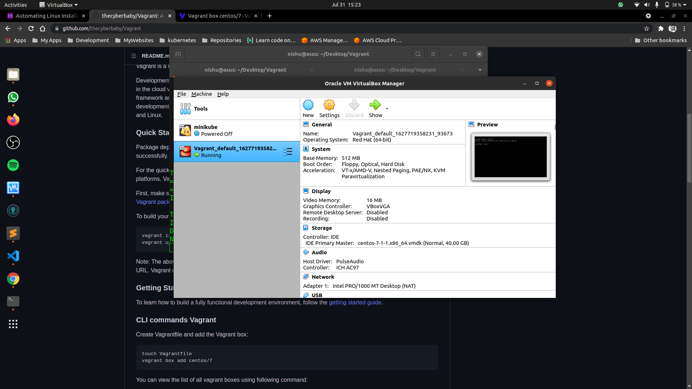

# Vagrant VM centos/7

- Vagrant: [https://www.vagrantup.com/](https://www.vagrantup.com/)
- VirtualBox: [https://www.virtualbox.org/wiki/Downloads](https://www.virtualbox.org/wiki/Downloads)
- Source: [https://github.com/thecyberbaby/Vagrant](https://github.com/thecyberbaby/Vagrant)

## Foreward

This documentation is meant for a rough, quick reference of all the parts needed to get up and running with
CentOS-7 within [vagrant](https://www.vagrantup.com/) environment.
The tools involved (git, Vagrant, VirtualBox, etc.) are not covered in great detail. This guide is intended to provide a starting point, and give some additional insight or considerations that may not be readily apparent about the whole process.

### Introduction Vagrant

Vagrant is a tool for building and distributing development environments.

Development environments managed by Vagrant can run on local virtualized
platforms such as VirtualBox or VMware, in the cloud via AWS or OpenStack,
or in containers such as with Docker or raw LXC`. `
Vagrant provides the framework and configuration format to create and
manage complete portable development environments. These development
environments can live on your computer or in the cloud, and are portable
between Windows, Mac OS X, and Linux.

### Quick Start

Package dependencies: Vagrant requires `bsdtar` and `curl` to be available on
your system PATH to run successfully.

For the quick-start, we'll bring up a development machine on
[VirtualBox](https://www.virtualbox.org/) because it is free and works
on all major platforms. Vagrant can, however, work with almost any
system such as [OpenStack](https://www.openstack.org/), [VMware](https://www.vmware.com/), [Docker](https://docs.docker.com/), etc.

First, make sure your development machine has
[VirtualBox](https://www.virtualbox.org/)
installed. After this,
[download and install the appropriate Vagrant package for your OS](https://www.vagrantup.com/downloads.html).

To build your first virtual environment:

    vagrant init centos/7
    vagrant up

Note: The above `vagrant up` command will also trigger Vagrant to download the
`centos/7` box via the specified URL. Vagrant only does this if it detects that
the box doesn't already exist on your system.

### Getting Started Guide

To learn how to build a fully functional development environment, follow the
[getting started guide](https://www.vagrantup.com/docs/getting-started).

### CLI commands Vagrant

Create Vagrantfile and add the Vagrant box:

    touch Vagrantfile
    vagrant box add centos/7

You can view the list of all vagrant boxes using following command:

    vagrant box list
    or
    vagrant box list | grep centos/7

Initialize the Vagrant environment -> The following command will initialize the Vagrant environment in current working Directory:

    vagrant up

This initializes the current directory to be a Vagrant environment by creating an initial Vagrantfile if one does not already exist.

If a first argument is given, it will prepopulate the config.vm.box setting in the created Vagrantfile.

If a second argument is given, it will prepopulate the config.vm.box_url setting in the created Vagrantfile.

--force - If specified, this command will overwrite any existing Vagrantfile.

Now have a look at the Vagrantfile content :
grep -v '^ \*#' Vagrantfile

    Vagrant.configure("2") do |config|
        config.vm.box = "centos/7"
    end

Congratulation! if you see these messages after running vagrant up command :

    nishu@asus:~/Desktop/Vagrant$ vagrant up
    Bringing machine 'default' up with 'virtualbox' provider...
    ==> default: Checking if box 'centos/7' version '2004.01' is up to date...
    ==> default: Machine already provisioned. Run `vagrant provision` or use the `--provision`
    ==> default: flag to force provisioning. Provisioners marked to run always will still run.

if need to shutdown the VM using vagrant halt command:

    nishu@asus:~/Desktop/Vagrant$ vagrant halt
    ==> default: Attempting graceful shutdown of VM...

you can reload the :

    vagrant reload

In order to login to CentOS Guest VM run the vagrant ssh command.
Log in to the guest :

    vagrant ssh

###Customizing Vagrantfile

you can customize the confguration of the machine by customizing the vagrantfile :

    nishu@asus:~/Desktop/Vagrant$ cat Vagrantfile
    # -*- mode: ruby -*-
    # vi: set ft=ruby :

    # All Vagrant configuration is done below. The "2" in Vagrant.configure
    # configures the configuration version (we support older styles for
    # backwards compatibility). Please don't change it unless you know what
    # you're doing.
    Vagrant.configure("2") do |config|
    # The most common configuration options are documented and commented below.
    # For a complete reference, please see the online documentation at
    # https://docs.vagrantup.com.

      # Every Vagrant development environment requires a box. You can search for
      # boxes at https://vagrantcloud.com/search.
      config.vm.box = "centos/7"

      # Disable automatic box update checking. If you disable this, then
      # boxes will only be checked for updates when the user runs
      # `vagrant box outdated`. This is not recommended.
      # config.vm.box_check_update = false

      # Create a forwarded port mapping which allows access to a specific port
      # within the machine from a port on the host machine. In the example below,
      # accessing "localhost:8080" will access port 80 on the guest machine.
      # NOTE: This will enable public access to the opened port
      # config.vm.network "forwarded_port", guest: 80, host: 8080

      # Create a forwarded port mapping which allows access to a specific port
      # within the machine from a port on the host machine and only allow access
      # via 127.0.0.1 to disable public access
      # config.vm.network "forwarded_port", guest: 80, host: 8080, host_ip: "127.0.0.1"

      # Create a private network, which allows host-only access to the machine
      # using a specific IP.
      # config.vm.network "private_network", ip: "192.168.33.10"

      # Create a public network, which generally matched to bridged network.
      # Bridged networks make the machine appear as another physical device on
      # your network.
      # config.vm.network "public_network"

      # Share an additional folder to the guest VM. The first argument is
      # the path on the host to the actual folder. The second argument is
      # the path on the guest to mount the folder. And the optional third
      # argument is a set of non-required options.
      # config.vm.synced_folder "../data", "/vagrant_data"

      # Provider-specific configuration so you can fine-tune various
      # backing providers for Vagrant. These expose provider-specific options.
      # Example for VirtualBox:
      #
      # config.vm.provider "virtualbox" do |vb|
      #   # Display the VirtualBox GUI when booting the machine
      #   vb.gui = true
      #
      #   # Customize the amount of memory on the VM:
      #   vb.memory = "1024"
      # end
      #
      # View the documentation for the provider you are using for more
      # information on available options.

      # Enable provisioning with a shell script. Additional provisioners such as
      # Ansible, Chef, Docker, Puppet and Salt are also available. Please see the
      # documentation for more information about their specific syntax and use.
      # config.vm.provision "shell", inline: <<-SHELL
      #   apt-get update
      #   apt-get install -y apache2
      # SHELL
    end

- ## Let's have a look into virtualbox
  

Then you're good to go!
